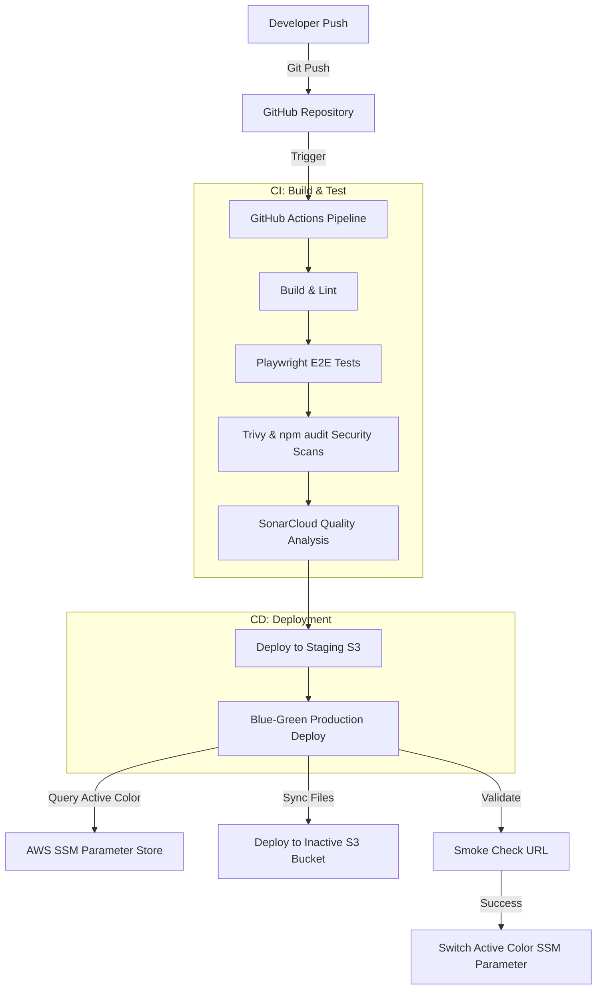

# Static Website CI/CD Pipeline (Blue-Green S3 Deployment)

A professional, production-grade DevOps pipeline for building, testing, securing, and deploying a high-performance static website on AWS S3 using GitHub Actions.

This setup is optimized for environments with restricted AWS IAM permissions (such as AWS Lab environments), utilizing direct S3 static website hosting and a zero-downtime Blue-Green promotion strategy managed via AWS Systems Manager (SSM) Parameter Store.

---

## 🏗️ Architecture Summary



1. **Continuous Integration (CI)**: 
   * Automated linting (HTML, CSS, JS) and building.
   * End-to-End (E2E) testing using Playwright in a head-less browser environment.
   * Code quality scan using SonarCloud.
   * Security vulnerability assessments via Trivy (file system scan) and `npm audit`.
2. **Continuous Deployment (CD)**:
   * **Staging deployment**: Automatically deployed to the Staging S3 website bucket upon a successful CI run.
   * **Production deployment (Blue-Green)**: Deploys zero-downtime updates by syncing code to the currently *inactive* production S3 bucket, verifying it with a smoke check, and updating the active color pointer in the AWS SSM Parameter Store.

---

## ⚙️ Prerequisites

To deploy and maintain this infrastructure, you need:
* An **AWS Account** with access key credentials.
* **Terraform CLI** installed locally (to manage S3 buckets and SSM parameters).
* **Node.js** (v18.x or higher) and **npm** installed locally.
* A **GitHub Repository** containing this codebase.

---

## 🚀 Setup & Deployment Steps

### Step 1: Deploy Infrastructure

Navigate to the `infra/terraform/` directory and deploy the S3 buckets and SSM parameters using Terraform:

```bash
# Initialize Terraform
terraform init

# Plan and preview the infrastructure changes
terraform plan

# Create the S3 website buckets and SSM configuration
terraform apply -auto-approve
```

Take note of the Terraform output values, as you will need them to configure GitHub Secrets:
* `staging_url`
* `staging_bucket_name`
* `blue_bucket_endpoint`
* `green_bucket_endpoint`
* `prod_blue_bucket_name`
* `prod_green_bucket_name`
* `ssm_parameter_active_color_name`

### Step 2: Configure GitHub Repository Secrets

Go to your repository on GitHub -> **Settings** -> **Secrets and variables** -> **Actions** and add the following repository secrets:

| Secret Name | Description / Value |
|---|---|
| `AWS_ACCESS_KEY_ID` | Your AWS Access Key ID |
| `AWS_SECRET_ACCESS_KEY` | Your AWS Secret Access Key |
| `AWS_SESSION_TOKEN` | Your AWS Session Token (required for temporary credentials/lab environments) |
| `AWS_REGION` | AWS Region where S3 buckets are hosted (e.g. `us-east-1`) |
| `STAGING_BUCKET_NAME` | The staging S3 bucket name (from Terraform output) |
| `STAGING_URL` | The staging website S3 URL (from Terraform output) |
| `BLUE_BUCKET_NAME` | The production blue S3 bucket name (from Terraform output) |
| `GREEN_BUCKET_NAME` | The production green S3 bucket name (from Terraform output) |
| `BLUE_BUCKET_ENDPOINT` | The blue S3 website endpoint domain (from Terraform output) |
| `GREEN_BUCKET_ENDPOINT` | The green S3 website endpoint domain (from Terraform output) |
| `PRODUCTION_URL` | Default production entrypoint URL (typically the Blue endpoint) |
| `SSM_PARAMETER_NAME` | `/site/static-site-cicd/prod-active-color` |
| `SONAR_TOKEN` | (Optional) Token generated from SonarCloud for code quality scans |

---

## 🔄 Blue-Green Routing Mechanism

Instead of relying on a CDN router, this pipeline uses a lightweight, S3-level Blue-Green routing scheme:
1. The deployment script checks the AWS SSM Parameter Store to see which color (`blue` or `green`) is currently marked active.
2. The pipeline builds and syncs the new site files to the **inactive** bucket (e.g., if Blue is active, it syncs to Green).
3. The script executes a curl-based smoke check directly against the inactive S3 bucket website endpoint.
4. If successful, the SSM Parameter Store is updated to reflect the new active color, completing a seamless roll-forward deployment.

### Triggering a Rollback
If a bug is discovered in production, you can instantly swap back to the previous version by updating the active color parameter back to the alternate bucket:

```bash
# Set target variables and execute the rollback script:
export SSM_PARAMETER_NAME="/site/static-site-cicd/prod-active-color"
./scripts/rollback.sh
```

---

## 🧪 Running Tests Locally

You can run quality gates and tests on your local machine before pushing to GitHub:

```bash
# Install dependencies
npm install

# Run static analysis and linting
npm run lint

# Run Playwright E2E smoke tests locally
npm run test:e2e
```
