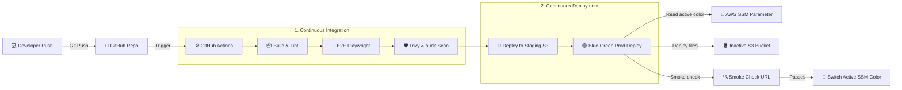

# ⚡ Static Website CI/CD Pipeline (S3 Blue-Green Deployment)

<p align="center">
  
  
  
  
</p>

A production-grade, highly secure DevOps pipeline for building, testing, and deploying a high-performance static website on AWS using GitHub Actions. 

This repository implements a **zero-downtime Blue-Green deployment strategy** using dual S3 buckets and AWS Systems Manager (SSM) Parameter Store to seamlessly swap environments upon successful quality checks.

---

## 🧭 Table of Contents
1. [🏗️ System Architecture](#️-system-architecture)
2. [✨ Features](#-features)
3. [🛠️ Technology Stack](#️-technology-stack)
4. [🚀 Quick Start Guide](#-quick-start-guide)
5. [⚙️ GitHub Secrets Configuration](#️-github-secrets-configuration)
6. [🔄 Blue-Green Switching & Rollbacks](#-blue-green-switching--rollbacks)
7. [🧪 Local Development & Verification](#-local-development--verification)

---

## 🏗️ System Architecture



---

## ✨ Features

*   **Zero-Downtime Releases:** Production deployments route traffic to the inactive environment, smoke-test it, and switch parameter points instantly.
*   **Automated Quality Gates:** Strict linting (HTML, CSS, JS) and Playwright browser tests must pass before any code reaches hosting.
*   **Pre-Release Security Scans:** Built-in vulnerability checks using **Trivy File System Scanning** and `npm audit`.
*   **Infrastructure as Code (IaC):** Fully declarative provisioning of AWS S3 Buckets, website endpoints, and SSM configs using Terraform.
*   **Instant Rollbacks:** Swift rollback capability to revert back to the previous version in under 30 seconds if a production issue is detected.

---

## 🛠️ Technology Stack

*   **Frontend:** HTML5, CSS3, Vanilla JavaScript (Vite compiler)
*   **Infrastructure:** Terraform, S3 Website Hosting, AWS SSM Parameter Store
*   **CI/CD Engine:** GitHub Actions
*   **Testing:** Playwright E2E framework
*   **Security:** Aquasecurity Trivy, npm security audit

---

## 🚀 Quick Start Guide

### Step 1: Deploy AWS Resources
Navigate to the Terraform folder and initialize/apply the configuration:
```bash
cd infra/terraform
terraform init
terraform apply -auto-approve
```

Save the values generated from the Terraform outputs. You will need them for Step 2.

### Step 2: Configure Secrets
Add the values from your Terraform output as Secrets inside your GitHub Repository (**Settings** -> **Secrets and variables** -> **Actions**). Refer to the configuration table below.

### Step 3: Trigger the Pipeline
Push a change to the `main` branch to trigger the pipeline automatically:
```bash
git add .
git commit -m "feat: customize web styling"
git push origin main
```

---

## ⚙️ GitHub Secrets Configuration

Set up the following variables in GitHub to authorize the deployment runner:

| Secret Name | Source / Value | Target Environment |
|---|---|---|
| `AWS_ACCESS_KEY_ID` | AWS Credentials | AWS Authentication |
| `AWS_SECRET_ACCESS_KEY` | AWS Credentials | AWS Authentication |
| `AWS_SESSION_TOKEN` | AWS Session Token (if using AWS Labs) | AWS Authentication |
| `AWS_REGION` | e.g. `us-east-1` | AWS Authentication |
| `STAGING_BUCKET_NAME` | `staging_bucket_name` (TF output) | Staging CD |
| `STAGING_URL` | `staging_url` (TF output) | Staging Smoke Check |
| `BLUE_BUCKET_NAME` | `prod_blue_bucket_name` (TF output) | Production CD |
| `GREEN_BUCKET_NAME` | `prod_green_bucket_name` (TF output) | Production CD |
| `BLUE_BUCKET_ENDPOINT` | `blue_bucket_endpoint` (TF output) | Production CD |
| `GREEN_BUCKET_ENDPOINT` | `green_bucket_endpoint` (TF output) | Production CD |
| `PRODUCTION_URL` | Endpoint of the active S3 Website | Prod Smoke Check |
| `SSM_PARAMETER_NAME` | `/site/static-site-cicd/prod-active-color` | Active Environment Lookup |

---

## 🔄 Blue-Green Switching & Rollbacks

During deployment, the script automatically target the alternate S3 bucket:

1. Resolves active target (e.g. `blue`).
2. Syncs static build directory to the alternate target (`green`).
3. Sends health requests to the inactive bucket endpoint.
4. Updates the parameter `prod-active-color` to the alternate color upon success.

### ↩️ Quick Rollback
If you need to quickly point the production website back to the previous deployment bucket:
```bash
export SSM_PARAMETER_NAME="/site/static-site-cicd/prod-active-color"
chmod +x ./scripts/rollback.sh
./scripts/rollback.sh
```

---

## 🧪 Local Development & Verification

Run local checks before pushing updates:

```bash
# Install packages
npm install

# Run linters
npm run lint

# Run Playwright E2E tests
npm run test:e2e
```
